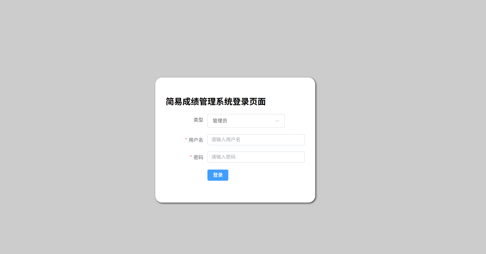
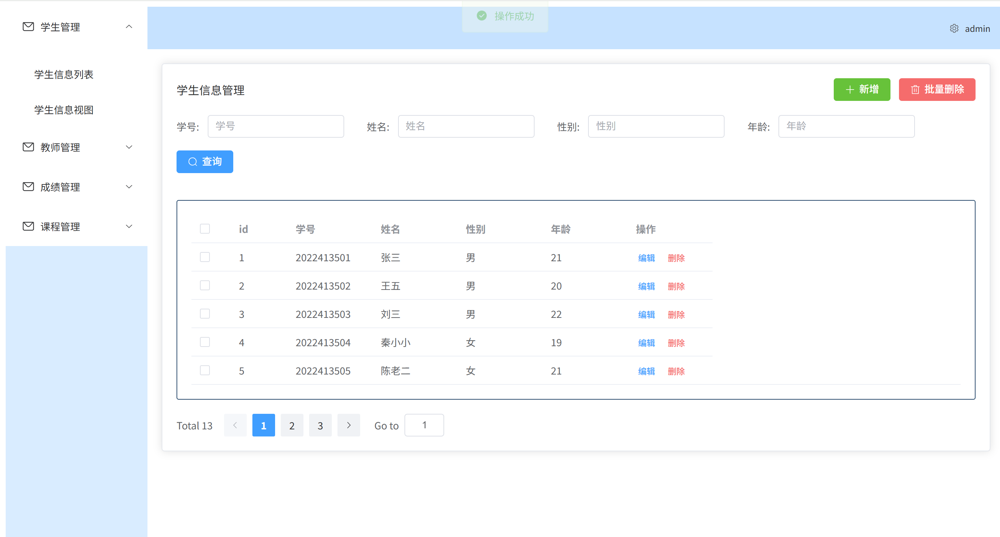
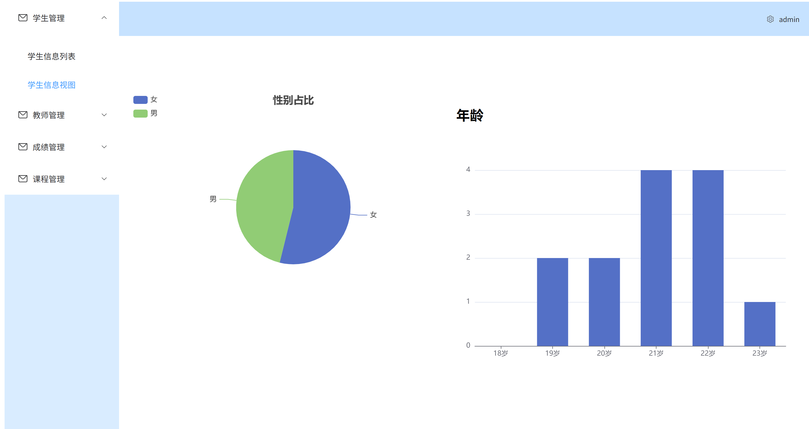
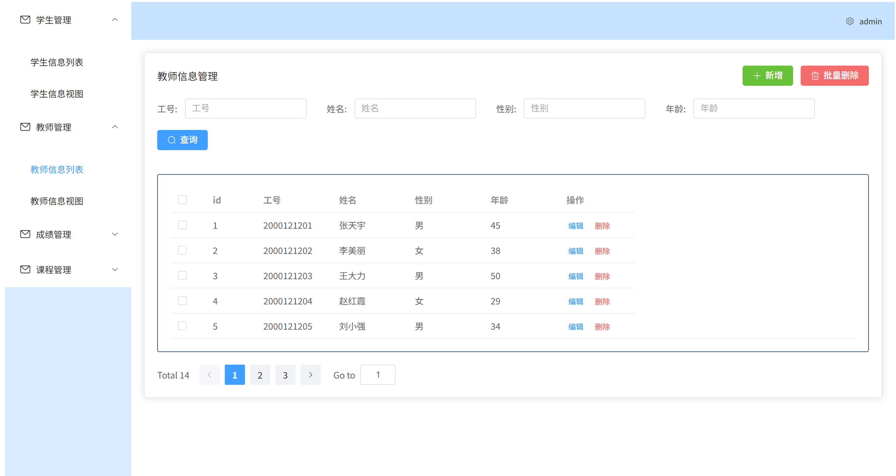
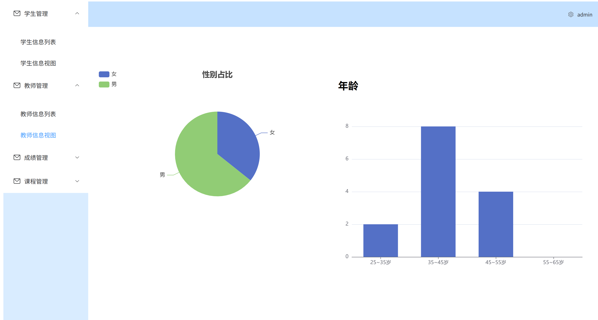
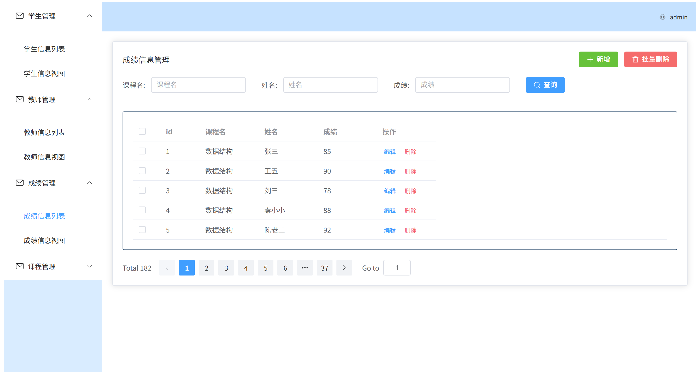
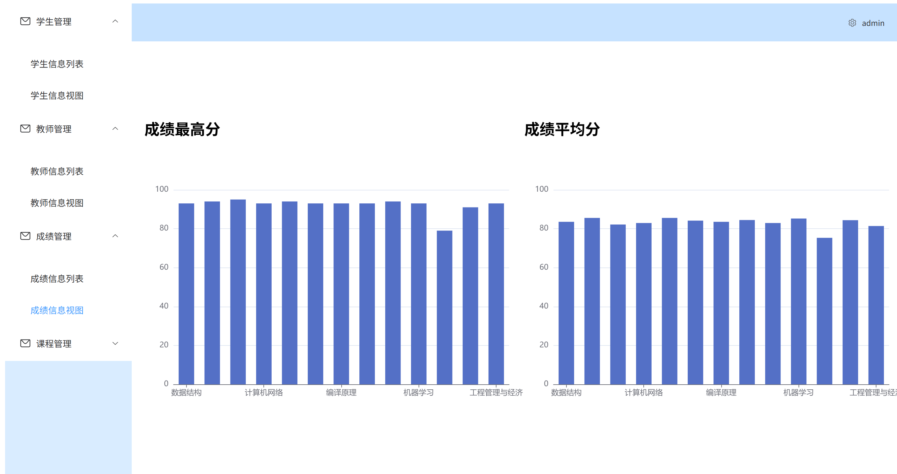
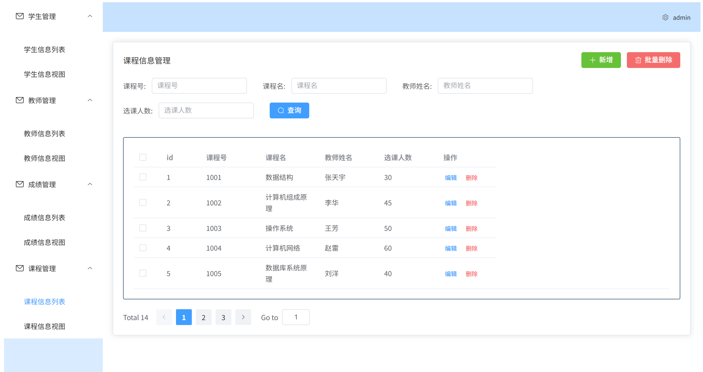
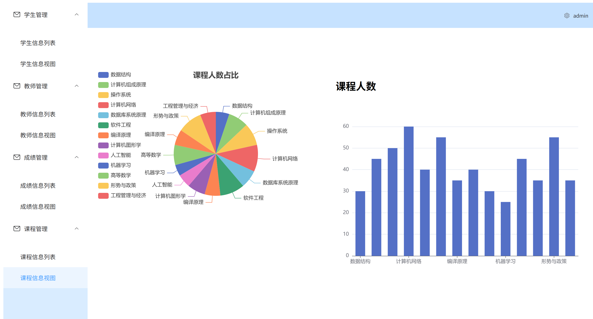

# Vue 3 + TypeScript + Vite

学生成绩管理系统 - 前端项目
项目概述
这是一个基于Vue 3和TypeScript构建的纯前端学生成绩管理系统，专为学校学习项目设计。项目使用public/mock文件夹下的假数据进行演示，无需后端即可运行。

# 技术栈
- Vue 3 (Composition API)
- TypeScript
- Vue Router
- Axios (用于模拟API请求)
- Element Plus (UI组件库)
- Mock数据 (位于public/mock文件夹)

# 功能特性

- 登录页

  
- 学生管理
-   学生信息列表
-   
-   学生信息视图
-   

- 教师管理
-   教师信息列表
-   
-   教师信息视图
-   

- 成绩管理
-   成绩信息列表
-   
-   成绩信息视图
-   

- 课程管理
-   课程信息列表
-   
-   课程信息视图
-   

项目结构

~~~
├── public/
│   ├── mock/                   # 模拟数据文件夹
│   │   ├── student.json        # 学生数据
│   │   ├── course.json         # 课程数据
│   │   ├── score.json          # 成绩数据
│   │   └── teachers.json        # 教师数据
├── src/
│   ├── assets/                  # 静态资源
│   ├── components/              # 公共组件
│   ├── router/                  # 路由配置
│   ├── store/                  # Pinia状态管理
│   ├── utils/                   # 工具函数
│   ├── views/                   # 页面组件
│   │   ├── Home/                # 首页页面
│   │   ├── Login/               # 登录页面
│   │   ├── System/              # 其他相关页面
│   ├── App.vue                  # 根组件
│   └── main.ts                  # 入口文件
├── .env                         # 环境变量
├── tsconfig.json                # TypeScript配置
└── package.json                 # 项目依赖
~~~

项目使用Axios拦截请求并返回对应的mock数据，模拟真实API调用。
